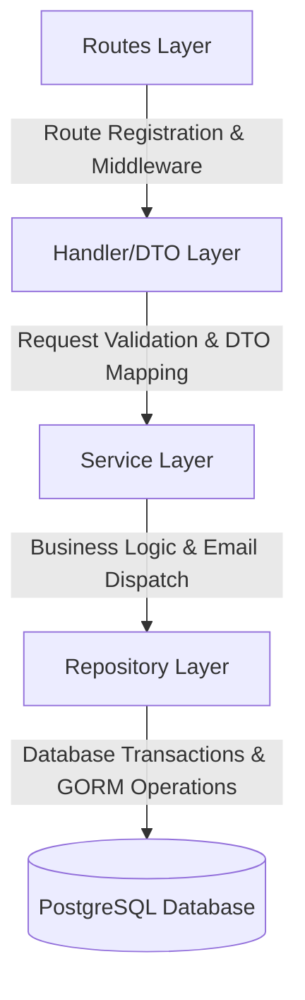
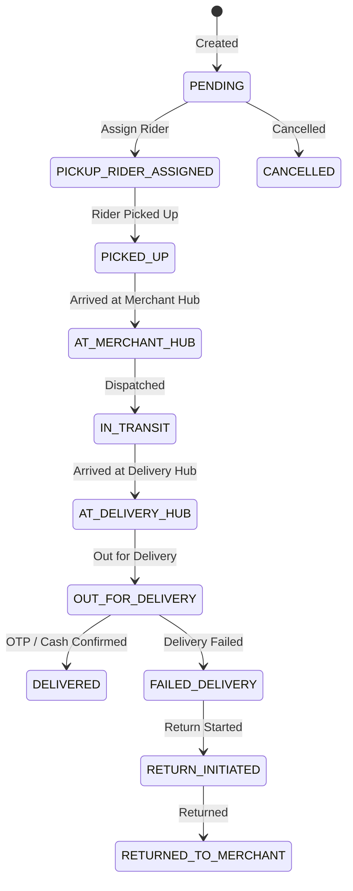

# Shipfide Server Architecture

This document describes the architectural layout, patterns, layer responsibilities, system workflows, and core business engines implemented in the Shipfide API Server.

---

## 🏛️ Clean Architecture Design

The project is structured according to Domain-Driven Design (DDD) and layered architecture principles:



### 1. Model Layer (`internal/models/`)
Defines GORM struct definitions mapped to PostgreSQL database tables.
- Includes lifecycle callbacks (`BeforeCreate`, `BeforeSave` for hashing passwords, auto-generating UUIDs, and resolving division mappings from districts).
- Retains pure struct definitions and constraint tags without referencing domain handler or routing logic.
- File naming follows **camelCase**: `codDeliveryConfirmation.go`, `deliveryConfirmation.go`, `guestSender.go`, `receiverFraudProfile.go`, `walkInPayment.go`.

### 2. Repository Layer (`internal/domain/<domain>/repository.go`)
Directly interfaces with GORM and PostgreSQL.
- Implements CRUD database queries and dynamic query builders.
- Encapsulates database **Transactions** (`db.Transaction`) to execute multi-table mutations atomically (e.g., creating `User` + `Account` + `Admin` in a single scope).

### 3. Service Layer (`internal/domain/<domain>/service.go`)
Contains core business logic and state transitions.
- Executes integrity checks (e.g. email uniqueness, phone fraud checks, minimum cashout limits).
- Invokes domain calculation engines (`pkg/pricing` for shipping fees & revenue splits).
- Dispatches asynchronous transactional email delivery via background goroutines.

### 4. Handler / DTO Layer (`internal/domain/<domain>/handler.go`)
Acts as HTTP controllers utilizing Fiber v3 context.
- Binds HTTP request payloads to DTO definitions (`internal/domain/<domain>/dto/request.go`).
- Validates structural rules using `CustomValidator` (`go-playground/validator/v10`).
- Formats standard camelCase JSON responses using `httpResponse.Success` and `httpResponse.Error`.

### 5. Routes Layer (`internal/domain/<domain>/register.go` & `internal/routes/routes.go`)
Registers HTTP routes under `/api/v1` and attaches authentication/authorization middleware pipelines.
- Domain directory naming follows **camelCase**: `deliveryConfirmation`, `guestSender`, `receiverFraud`, `walkInPayment`.

---

## 📦 Domain Modules Overview

| Domain | Responsibilities | Key Entites |
| :--- | :--- | :--- |
| `auth` | Authentication, JWT token lifecycle, password resets, OTP generation | `Account`, `Session`, `User` |
| `user` | User account management and role-based permissions | `User` |
| `admin` | Administrative staff creation, hub scoping, password reset invites | `Admin` |
| `hub` | Operations hub registration and physical zone mapping | `Hub` |
| `session` | Active device session tracking and token revocation | `Session` |
| `address` | Saved address book and zone mapping validation | `Address` |
| `merchant` | Merchant profiles, KYC approval, COD caps, first delivery tracking | `Merchant` |
| `rider` | Rider profiles, vehicle classification, hub assignment, rating summary | `Rider` |
| `guestSender` | Walk-in guest customer registration by admins | `GuestSender` |
| `shipment` | Full shipment lifecycle, tracking generator, pricing calculation | `Shipment` |
| `deliveryConfirmation` | Prepaid delivery OTP verification and rider COD deposit approval | `DeliveryConfirmation`, `CodDeliveryConfirmation` |
| `walkInPayment` | Recording hub walk-in parcel payments collected by admins | `WalkInPayment` |
| `receiverFraud` | Receiver phone risk scoring (0-100) and COD block management | `ReceiverFraudProfile` |
| `rating` | Receiver-to-rider delivery ratings and merchant platform feedback | `DeliveryRating`, `MerchantDeliveryRating` |
| `withdrawal` | Cashout requests for Riders and Merchants (min ৳100 limit) | `Withdrawal` |

---

## 🔄 Core Business Workflows

### 📦 Shipment State Machine


### 💰 Revenue Split Calculation
When a shipment reaches `DELIVERED` status, `pricing.CalculateRevenueSplit` automatically computes payouts:
- **Same City / Same District**: Rider Share 50%, System Share 50%.
- **Outside District**: Rider Share 40%, System Share 60%.
- **Merchant Net Payout**: `CodAmount` - `DeliveryCharge` (for COD parcels).

### 🛡️ Receiver Fraud Scoring
- Initial profile starts at **Score 100** (`TRUSTED`).
- Each completed delivery updates delivery count and refreshes score:
  $$\text{FraudScore} = \left( \frac{\text{TotalDelivered}}{\text{TotalOrders}} \right) \times 100$$
- If FraudScore $\le 20$, `CODBlocked` is set to `true`, preventing COD creation for that receiver phone number.

---

## 🔑 Authentication Architecture

```
┌─────────────────────────────────────────────────────────────┐
│ 1. AccessToken (JWT) -> High performance token verification │
├─────────────────────────────────────────────────────────────┤
│ 2. RefreshToken (UUID) -> Relational GORM Account link      │
├─────────────────────────────────────────────────────────────┤
│ 3. SessionToken (UUID) -> Active device session tracking     │
└─────────────────────────────────────────────────────────────┘
```

Token resolution precedence in authentication middleware:
1. `access_token` Cookie
2. `token` Cookie
3. `Authorization: Bearer <token>` Header
